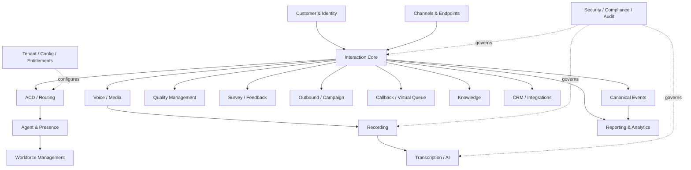
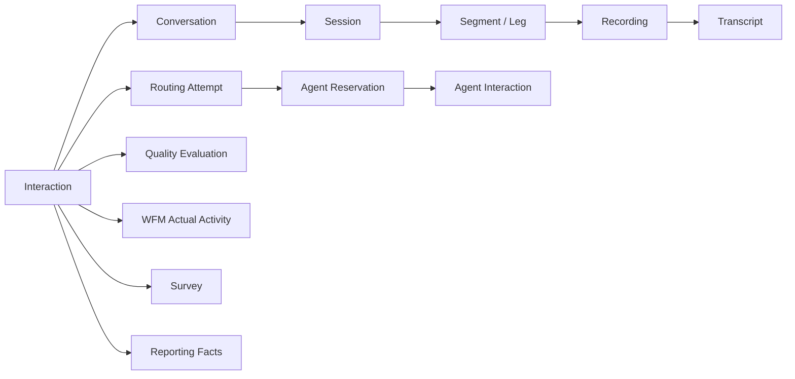

# CCaaS Domain Model

> A canonical, implementation-neutral domain model for modern Contact Center as a Service platforms.

## Mission

CCaaS is not one application. It is a set of tightly related business and real-time domains spanning customer interactions, omnichannel routing, voice/media, agents, workforce, recording, transcription, quality, analytics, surveys, outbound engagement, AI, compliance, administration, integrations and platform operations.

This repository creates a shared vocabulary and relationship model across those domains so architecture, APIs, events, data platforms and reporting can use consistent semantics.

## Modeling principles

1. **Interaction is the correlation backbone** — operational artifacts should be traceable to the customer interaction that produced them.
2. **Separate business concepts from transport concepts** — a Conversation is not a SIP dialog; an Interaction is not an RTP stream.
3. **Explicit bounded contexts** — domains own their models and publish contracts rather than sharing an uncontrolled database schema.
4. **Identity is first-class** — stable identifiers support correlation across routing, media, recording, transcription, QM, WFM and analytics.
5. **State transitions are explicit** — routing, agent, recording and interaction lifecycles are modeled rather than inferred from timestamps.
6. **Events describe facts** — domain events represent completed state changes and support idempotent consumers.
7. **Multi-tenancy is structural** — tenant/business boundaries are part of ownership, authorization and data partitioning.
8. **PII/PCI/PHI-aware modeling** — sensitive data classification, access and retention are architectural concerns; this model does not itself confer compliance.

## Domain landscape



## Bounded contexts

| Context | Core concepts |
|---|---|
| Tenant & Organization | Tenant, BusinessUnit, Team, Site, Entitlement |
| Customer & Identity | Customer, ContactPoint, Identity, Consent |
| Interaction Core | Interaction, Conversation, Participant, Session, Segment, Disposition |
| Channels | Voice, Chat, Messaging, Email, Social, Video |
| Voice & Media | CallLeg, MediaSession, RTPStream, Codec, DTMF |
| Routing / ACD | Queue, Skill, RoutingPolicy, RoutingAttempt, Reservation, Priority |
| Agent | Agent, Presence, RoutingState, Capacity, Device, Session |
| IVR / Self-Service | Flow, Prompt, Menu, Intent, BotSession, ASR/TTS |
| Recording | Recording, RecordingSegment, Policy, Pause, Retention |
| Transcription & AI | Transcript, Utterance, Speaker, Topic, Entity, Sentiment, Summary, Assist |
| Quality Management | Evaluation, Form, Question, Score, Calibration, Coaching |
| Workforce Management | Forecast, StaffingRequirement, Schedule, Shift, Activity, Adherence |
| Survey / Feedback | Survey, Invitation, Question, Response, CSAT, NPS, CES |
| Reporting & Analytics | Metric, Measure, Dimension, KPI, Fact, Dashboard |
| Outbound | Campaign, ContactList, DialingPolicy, Attempt, DNC |
| Callback | CallbackRequest, PromiseWindow, Attempt, Outcome |
| Knowledge | Article, Version, Category, Recommendation |
| Integration | CRMRecord, Connector, Webhook, ExternalReference |
| Security & Governance | Principal, Role, Permission, DataClass, RetentionPolicy, AuditEvent |
| Platform Operations | Configuration, Feature, Usage, ObservabilityCorrelation |

## Interaction correlation spine



The model deliberately preserves multiple identifiers. A customer interaction can contain multiple conversations, transfers, call legs, recordings and agent assignments. Collapsing all of them into a single `call_id` loses important semantics.

## Repository map

```text
model/
  domain-landscape.md
  canonical-identifiers.md
  interaction-core.md
  routing-agent.md
  recording-transcription.md
  wfm.md
  quality.md
  survey-feedback.md
  reporting-analytics.md
  outbound-callback.md
  security-governance.md
events/
  event-catalog.md
schemas/
  interaction-event.schema.json
decisions/
  ADR-001-interaction-as-correlation-backbone.md
glossary/
  canonical-terms.md
```

## Status

The repository is an evolving reference model. It distinguishes conceptual architecture from executable/tested implementation and avoids claiming certification or product compatibility that has not been demonstrated.
