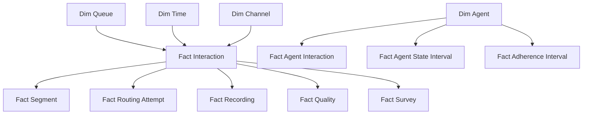

# CCaaS Analytical Fact and Dimension Model

## Star-schema landscape

## Grains
FactInteraction: one row per canonical interaction or defined interaction outcome projection.
FactSegment: one row per interaction segment.
FactRoutingAttempt: one row per routing attempt.
FactAgentInteraction: one row per agent assignment/handling segment.
FactAgentStateInterval: one row per contiguous agent-state interval.
FactQuality: one row per completed/versioned evaluation.
FactSurvey: one row per submitted survey response.

Never mix grains in a metric without explicit aggregation logic.

## Slowly changing dimensions
Organizational attributes such as team/site can change. Historical reporting must define whether it reports using attributes effective at event time or current organization. Preserve effective dating where historical truth matters.

## Metric lineage
Every KPI should link to source facts, filters, formula/version, timezone/business calendar and owner. This enables the same definition across dashboards, exports and APIs.
