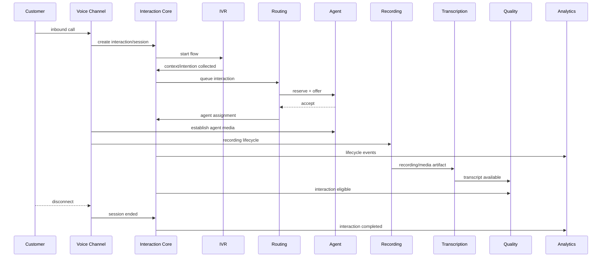

# End-to-End Voice Interaction Domain Flow

## Correlation
One `interaction_id` ties the business journey together while channel/media/routing/recording artifacts retain their own IDs. Transfer/conference can create additional participants, segments, call legs and recordings without destroying the parent identity.

## Failure semantics
If transcription fails after the call completes, the Interaction remains completed; transcription owns a failed/retryable processing state. If analytics is unavailable, real-time call processing should not become synchronously dependent on dashboard persistence. Bounded-context ownership makes such degradation explicit.
