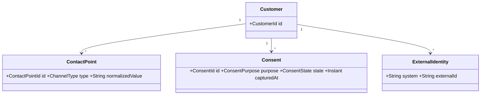

# Customer Identity, Contact Points and Consent

## Core concepts
A Customer is a business-domain party. A ContactPoint is an address used to communicate: telephone number, email address, messaging identity or channel-specific handle. IdentityResolution links observed contact points to customer records with provenance and confidence.

## Consent
Consent is purpose-, channel-, jurisdiction- and time-sensitive. Model source, capture mechanism, policy/version, effective period and withdrawal rather than a single `consent=true` flag.

## Privacy
Contact-point values are sensitive and should not be used as internal primary keys. Tokenized/masked projections can support operational use while limiting unnecessary exposure.
