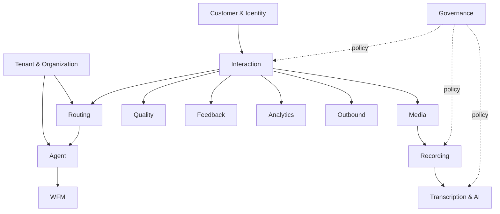

# Domain Landscape and Bounded Contexts

## Context map

A bounded context owns the meaning and invariants of its concepts. Other contexts consume published APIs/events/projections rather than mutating another domain's state directly.

## Aggregate ownership

| Aggregate root | Owning context | Examples of invariants |
|---|---|---|
| Interaction | Interaction Core | stable identity; lifecycle transitions |
| Queue | Routing | routing policy and membership references |
| RoutingAttempt | Routing | idempotent attempt identity; one terminal outcome |
| Agent | Agent | identity and routability projection |
| Recording | Recording | policy, lifecycle, segment integrity |
| Transcript | Transcription | source artifact relationship and version |
| Evaluation | Quality | form/version, evaluator, scoring lifecycle |
| Schedule | WFM | agent/time/activity allocation |
| SurveyResponse | Feedback | invitation/question version relationship |
| Campaign | Outbound | policy, audience and attempt rules |

## Cross-context rule

Foreign domains reference stable IDs and consume contracts. They do not treat another domain's internal tables as their API.

Example: Quality Management may reference `interaction_id`, `recording_id`, `transcript_id` and `agent_id`, but it owns the Evaluation aggregate and scoring workflow.

## Shared kernel candidates

Only concepts whose semantics are genuinely universal should enter a shared kernel:

- TenantId
- InteractionId
- AgentId
- Instant / TimeRange
- ChannelType
- DataClassification
- CorrelationId

Over-sharing canonical objects creates coupling. Prefer identifiers and versioned contracts to one giant mutable enterprise object.
