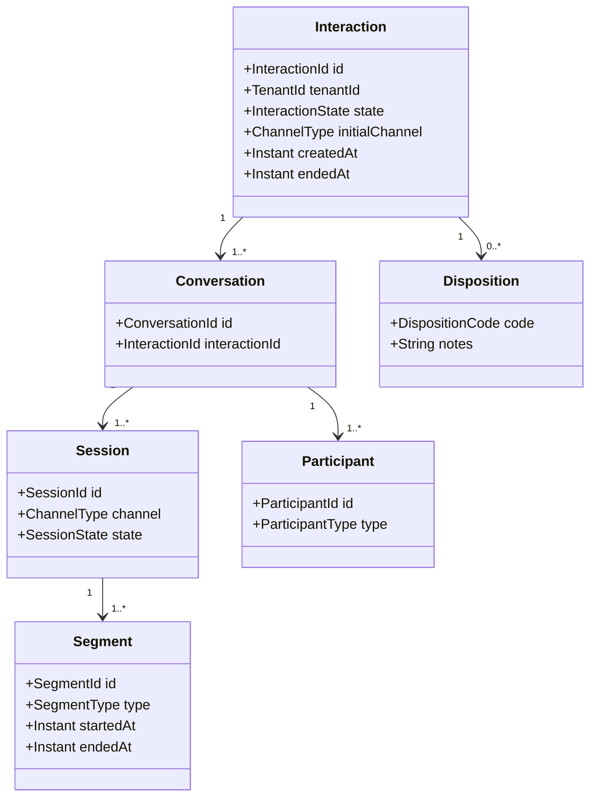
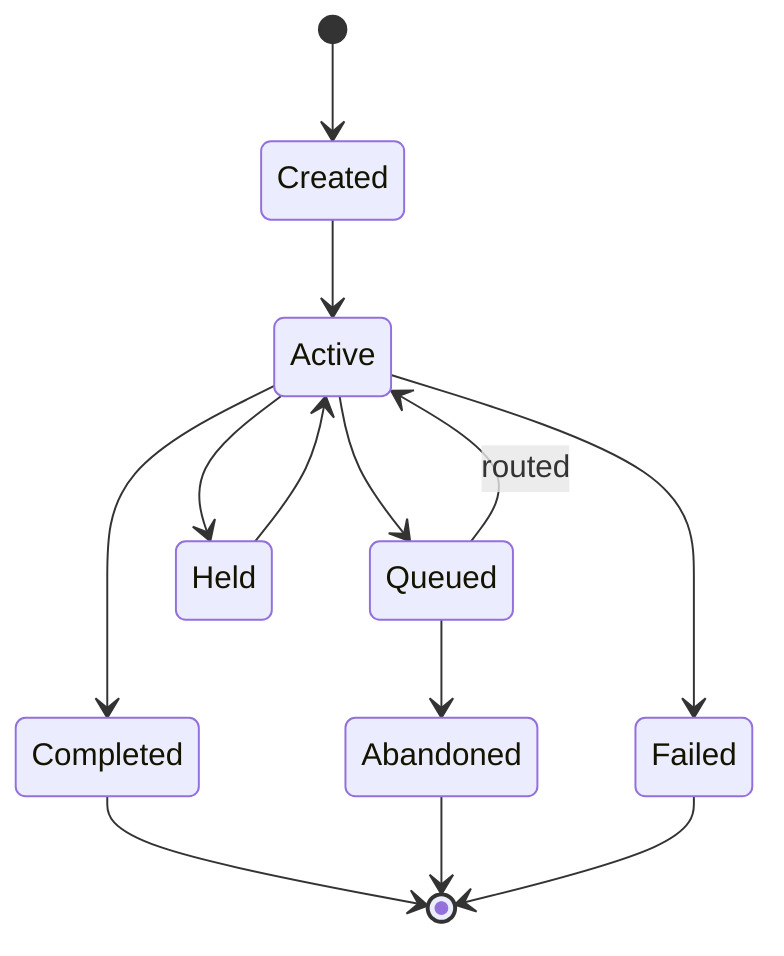

# Interaction Core Domain

## Definitions

**Interaction** — top-level customer engagement tracked by the platform for a business purpose.

**Conversation** — coherent communication thread within an interaction.

**Session** — channel-specific period of communication.

**Segment** — a bounded portion of a session associated with routing, participant or technical-leg changes.

**Participant** — customer, agent, bot, supervisor or external party taking part.

A transfer does not necessarily create a new Interaction. It commonly creates new segments and may create additional channel/technical sessions.

## Conceptual class model

## Lifecycle

This is conceptual. Channel-specific state machines remain in their owning contexts.

## Timing semantics

Do not overload one duration. Reporting may need:

- offered_at
- queued_at
- routing_started_at
- agent_offered_at
- agent_answered_at
- media_connected_at
- hold intervals
- wrap_up_started_at / ended_at
- interaction_completed_at

Metrics such as speed of answer, handle time and queue time must declare which timestamps they use.
