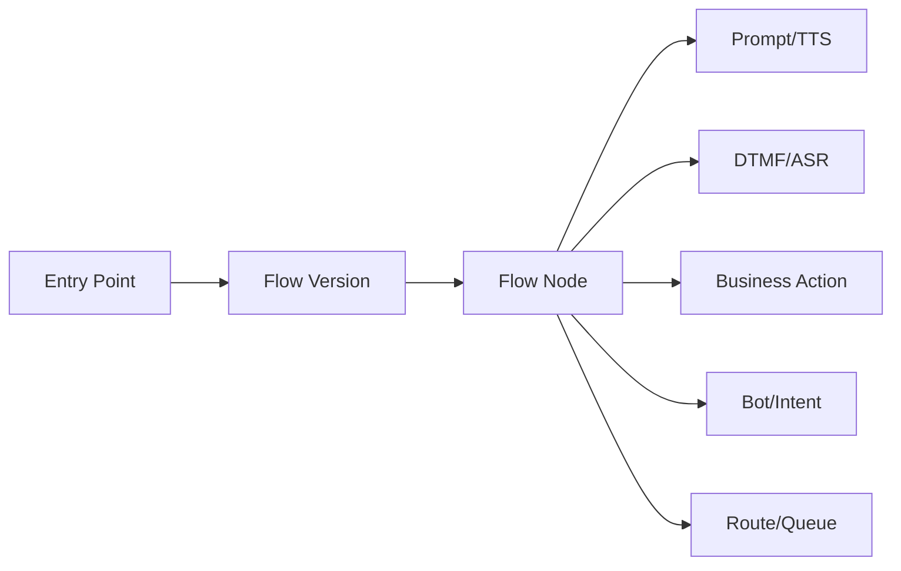

# IVR, Workflow and Self-Service Domain

## Model

Core concepts: EntryPoint, FlowDefinition, FlowVersion, Node, Prompt, InputCollection, Intent, BotSession, BusinessAction, ErrorHandler and Exit.

## Versioning
An interaction should retain the flow version executed. Editing a published flow creates a new version rather than changing historical meaning.

## External calls
Business actions invoking CRM/payment/order/identity services require explicit timeout, retry/idempotency, error mapping and fallback behavior.

## Sensitive input
Payment or other sensitive collection must be represented with data-classification and capture/recording controls. The model describes policy relationships; it does not assert PCI or other certification.
