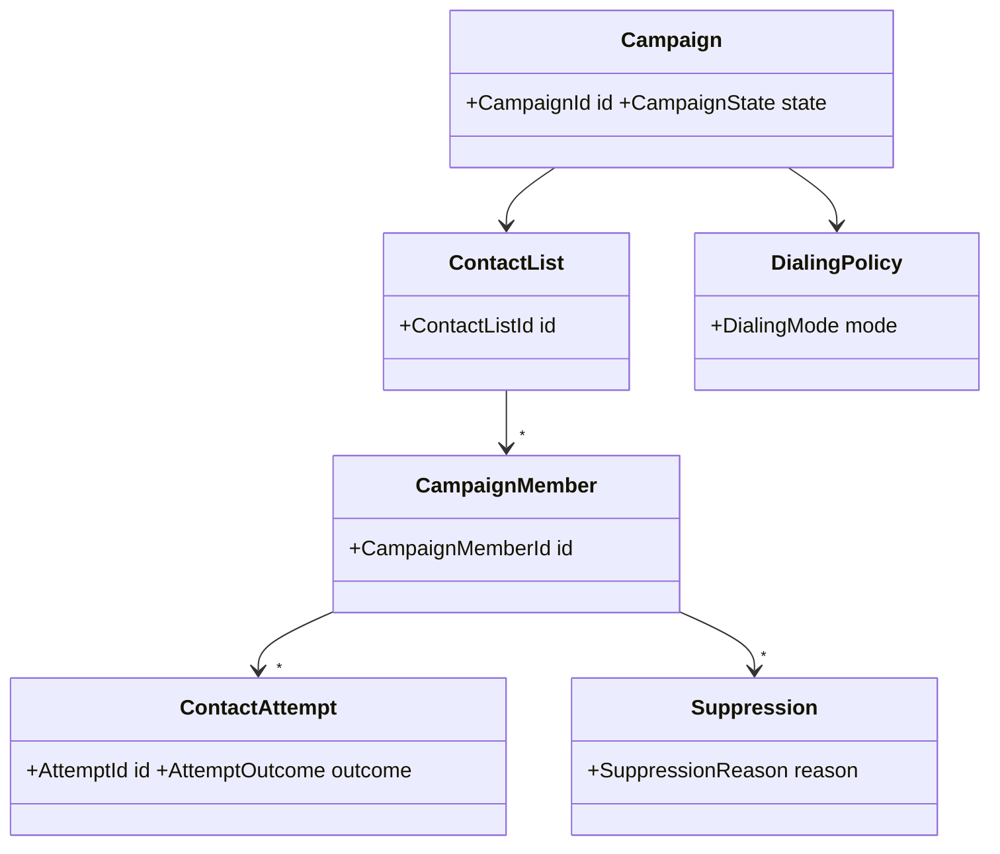

# Outbound, Campaign and Callback Domains

## Outbound


Attempt identity is separate from Interaction identity: an attempt can fail before an interaction is established.

## Callback / virtual queue
A CallbackRequest represents a customer's request to preserve service intent without remaining connected.

Lifecycle:
```text
Requested → Eligible → Scheduled/Waiting → Attempting → Connected → Completed
                                      ↘ Failed → Retry/Expired
                                      ↘ Cancelled
```

Model requested number/contact point, originating queue, enqueue context, promised/eligible window, priority preservation policy, attempt policy, attempts and terminal outcome.

Estimated wait time is an estimate artifact with model/version/timestamp, not a guaranteed property unless a business policy explicitly creates such a commitment.
