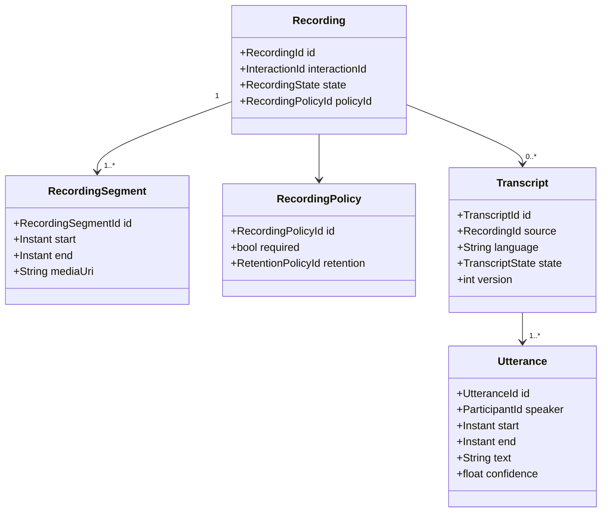

# Recording, Transcription and Conversation Intelligence

## Recording domain

Recording is an independently governed artifact lifecycle, not merely a URL on a call record.



## Recording lifecycle

States can include Requested, Recording, Paused, Resumed, Stopped, Processing, Available, Failed, RetentionExpired and Deleted. Pause/resume is modeled as auditable state/segments rather than silently editing duration.

## Transcription lifecycle

A transcript can be streaming or post-interaction and can have multiple versions. The model must retain source artifact/model/version/language metadata sufficient to understand how text was produced.

## Derived intelligence

Derived artifacts can include sentiment observations, topics, intents, entities, summaries, action items, compliance findings and agent-assist suggestions.

Each derived artifact should preserve provenance:

```text
interaction
 → source recording/transcript
 → model/provider + version
 → processing timestamp
 → derived artifact
```

AI output should not silently overwrite human-authored dispositions or quality decisions.

## Sensitive data

Recordings and transcripts can contain highly sensitive information. The model supports data classification, policy references, access/audit relationships, retention, legal hold and redaction/tokenization metadata. Exact controls depend on applicable obligations and implementation.
