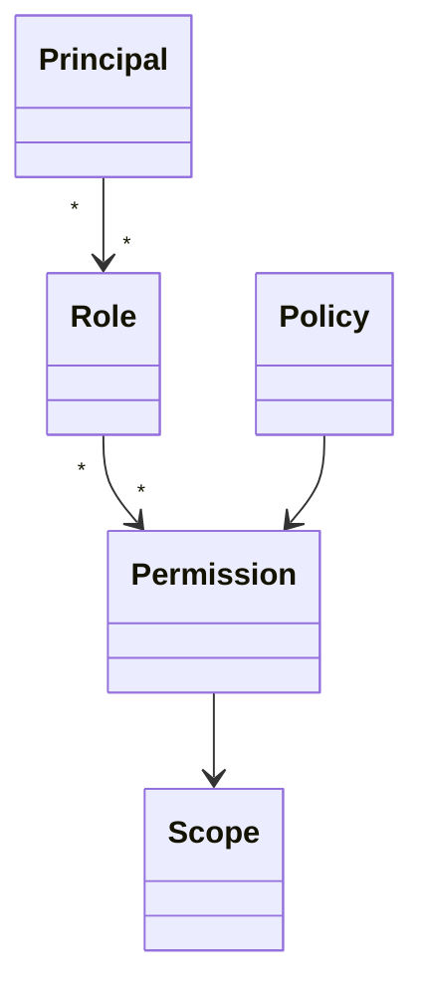

# Security, Governance, Audit and Retention

## Authorization model

Authorization decisions should combine principal, action, resource, tenant/business scope and applicable policy. High-risk artifacts such as recordings/transcripts may require narrower permissions than interaction metadata.

## Data classification
Example classes: Public, Internal, Confidential, PII, HighlySensitive and Regulated. Concrete organizations should map these to their own policies and legal obligations.

## Audit
AuditEvent should capture actor/principal, action, target resource/type, tenant, time, decision/outcome and relevant request/correlation context. Avoid placing secrets or unnecessary sensitive payloads in audit logs.

## Retention
RetentionPolicy defines artifact type/scope, retention period/rule, disposition and legal-hold interaction. Retention applies independently to recordings, transcripts, interaction metadata, analytics and audit data where required.

## Encryption and keys
The domain model can reference encryption/key policy and key identifiers. Cryptographic implementation, rotation and custody belong to security architecture.

## Governance principle
Deletion is a workflow, not merely a SQL DELETE. It may require authorization, hold checks, downstream propagation, immutable audit and proof/reconciliation.
