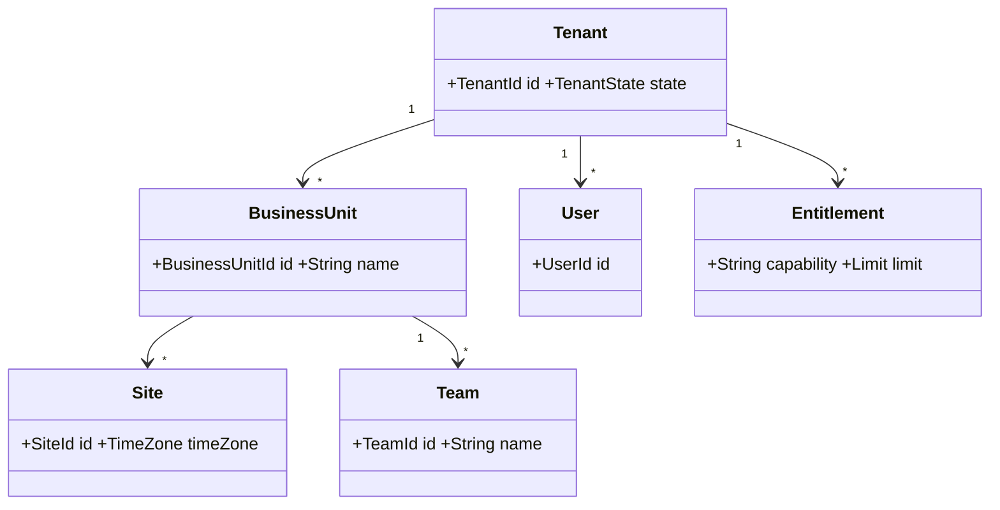

# Tenant, Organization and Entitlement Domain

## Purpose
Defines the administrative boundary within which every CCaaS resource is owned and authorized.

## Core model

## Invariants
Every tenant-owned aggregate carries a tenant boundary. Cross-tenant references are invalid unless a deliberately modeled platform-level relationship permits them. Business units, sites and teams are organizational structures, not authorization boundaries by assumption; authorization is explicit.

Entitlements describe enabled capabilities and limits such as channels, recording, WFM, QM, storage or concurrent usage. They should not be scattered as product-specific booleans across unrelated aggregates.

## Lifecycle
Tenant states can include Provisioning, Active, Suspended and Decommissioning. Decommissioning requires data-retention and legal-hold evaluation before destructive deletion.
