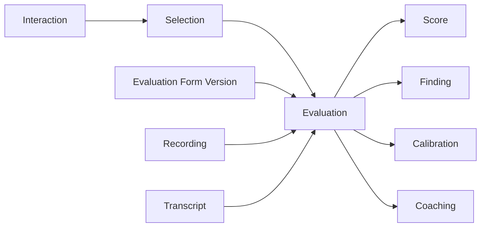

# WFM, Quality Management and Customer Feedback

## Workforce Management

```text
Historical Demand
      ↓
Forecast
      ↓
Staffing Requirement
      ↓
Schedule
      ↓
Shift / Activity
      ↓
Actual Agent Activity
      ↓
Adherence / Conformance
      ↓
Intraday Reforecast
```

Core concepts include Forecast, ForecastInterval, Workload, ServiceGoal, StaffingRequirement, Schedule, Shift, Activity, TimeOffRequest, ActualActivity, AdherenceInterval and IntradayAdjustment.

Forecast demand and actual interaction facts are related but not identical datasets. Forecasts should be versioned so planners can compare forecast-at-the-time with actual outcomes.

## Quality Management



An Evaluation references the exact version of the form used. Otherwise historical scores can change meaning when a form is edited.

Important concepts: EvaluationForm, FormVersion, Section, Question, Answer, Score, CriticalFailure, Finding, Evaluator, CalibrationSession, Dispute/Appeal and CoachingAction.

Automated/AI evaluation and human evaluation should remain distinguishable, with provenance and confidence where applicable.

## Survey and feedback

A SurveyDefinition is versioned independently from an Invitation and Response.

```text
SurveyDefinition v3
  → Invitation
      → Customer
      → Interaction
      → Response
          → QuestionResponses
          → derived metric (when applicable)
```

CSAT, NPS and CES should be modeled as defined metrics with scale/method metadata rather than generic score fields. Reporting must preserve survey version, invitation channel, response time and population/eligibility rules to avoid misleading comparisons.
