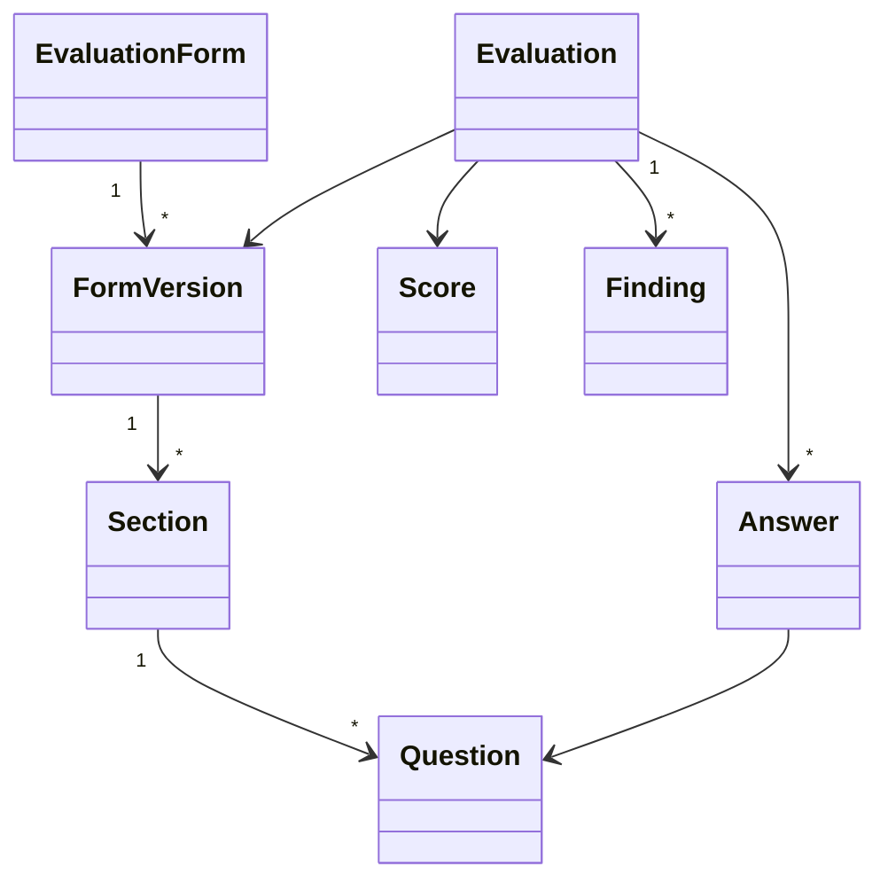

# Quality Evaluation Model

## Structure

## Scoring
Questions can support numeric, boolean, categorical or informational answers. Weighting, N/A behavior, critical failures and section rollups belong to the immutable FormVersion scoring definition.

## Provenance
Evaluation records evaluator type (human/automated/assisted), evaluator identity where appropriate, source recording/transcript versions, model/version for automation, timestamps and calibration context.

## Lifecycle
Draft → InProgress → Completed → optionally Disputed/Reviewed. A completed evaluation is not silently recalculated when a form changes.
